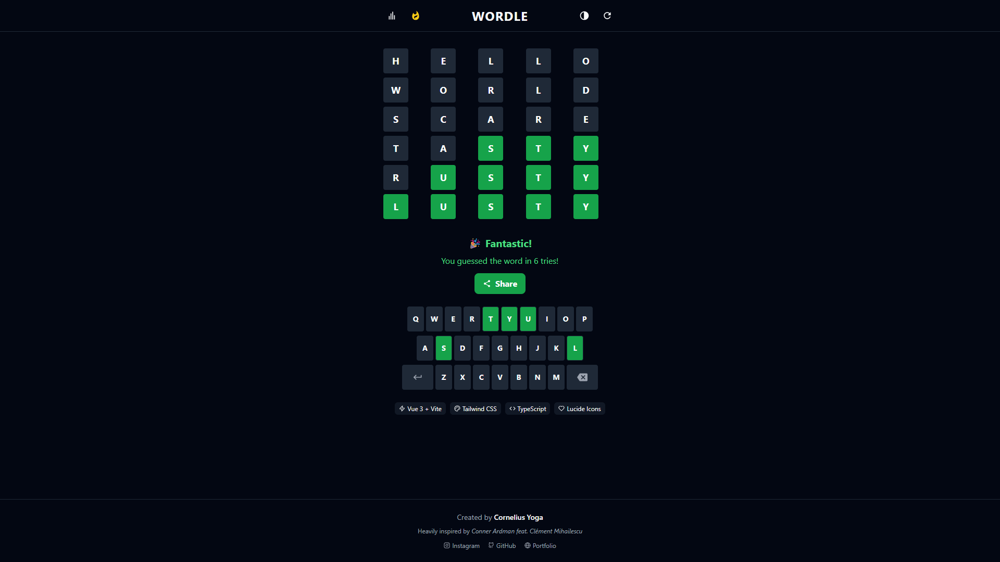

# Wordle Vue
### A modern, accessible, and beautiful Wordle clone built with Vue 3, Vite, TypeScript, and Tailwind CSS.

## Features
- Classic Wordle gameplay (6 tries, 5-letter words)
- Hard mode (no yellow hints)
- Virtual keyboard
- Animated game board and keyboard
- Game statistics and guess distribution
- Shareable results
- High contrast mode for accessibility
- Responsive and mobile-friendly design
- Built with Vue 3, Vite, TypeScript, Tailwind CSS, and Lucide icons

## Demo
Screenshot of Wordle Vue:


## Getting Started
Prerequisites
- Node.js (v16+ recommended)
- npm or yarn

### Installation
```bash
# Clone the repository
git clone https://github.com/your-username/wordle-vue.git
cd wordle-vue

# Install dependencies
npm install
# or
yarn install
```

### Running the App
```bash
# Start the development server
npm run dev
# or
yarn dev
```
Open http://localhost:5173 to view it in your browser.

### Building for Production
```bash
npm run build
# or
yarn build
```
### Preview Production Build
```bash
npm run preview
# or
yarn preview
```

## Folder Structure
```
wordle-vue/
  ├── public/           # Static assets
  ├── src/
  │   ├── assets/       # Images and icons
  │   ├── components/   # Vue components
  │   ├── data/         # Word list
  │   ├── App.vue       # Main app component
  │   ├── main.ts       # App entry point
  │   └── style.css     # Tailwind CSS
  ├── package.json      # Project metadata and scripts
  ├── tailwind.config.js
  └── vite.config.ts
```
## Credits
Heavily inspired by [Conner Ardman & Clément Mihailescu](https://www.youtube.com/watch?v=5xf4_Kx7azg)

##  Get In Touch
<div align="center">
  <a href="https://www.instagram.com/corneliusyoga" target="_blank"></a>&nbsp;
  <a href="https://www.linkedin.com/in/cornelius-yoga-783b6a291" target="_blank"></a>&nbsp;
  <a href="https://www.youtube.com/channel/UCj0TlW5vLO6r_Nlwc8oFBpw" target="_blank"></a>&nbsp;
  <a href="https://czy.digital" target="_blank"></a>
  <br/><br/>
  
  <br/>
  <sub>Made by Cornelius Ardhani Yoga Pratama</sub>
</div>